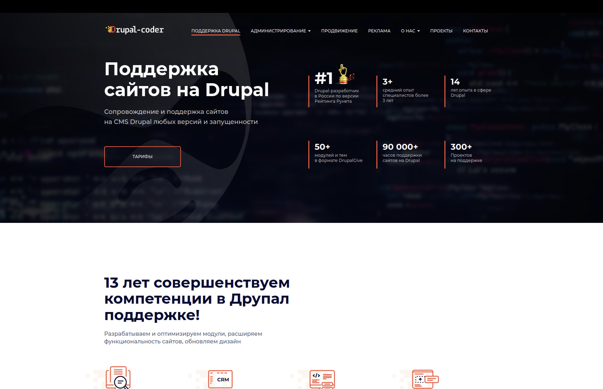

<!-- PROJECT LOGO -->
<br />
<div align="center">
  <a href="https://github.com/othneildrew/Best-README-Template">
    
  </a>

  <h3 align="center">Drupal Coder University Project</h3>

  <p align="center">
    Проект Балабанова Виталия и Богданова Родиона по разработке пользовательского WEB интерфейса
    <br />
  </p>
</div>

<!-- TABLE OF CONTENTS -->
<details>
  <summary>Table of Contents</summary>
  <ol>
    <li>
      <a href="#about-the-project">About The Project</a>
    </li>
    <li>
      <a href="#getting-started">Getting Started</a>
      <ul>
        <li><a href="#installation">Installation</a></li>
      </ul>
    </li>
    <li><a href="#roadmap">Roadmap</a></li>
    <li><a href="#contact">Contact</a></li>
    <li><a href="#acknowledgments">Acknowledgments</a></li>
  </ol>
</details>

<!-- ABOUT THE PROJECT -->

## About The Project



Данный проект посвящен созданию адаптивного веб-интерфейса с использованием SCSS и методологии именования классов BEM. Работа над проектом будет распределена между членами команды (2-3 человека), где каждому участнику будет назначена отдельная компонента страницы, такая как футер, шапка или форма.

Основная цель — реализовать страницу согласно предоставленным макетам, обеспечивая адаптивность (mobile-first) и интерактивность с помощью JavaScript.

<p align="right">(<a href="#readme-top">back to top</a>)</p>

<!-- GETTING STARTED -->

## Getting Started

### Installation

1. Скачиваем репозиторий:
   ```sh
   git clone https://github.com/gabbyhunter1/Drupal-Coder-Project.git
   ```
2. Install NPM packages
   ```sh
   npm install
   ```
   Если npm не установлен - https://nodejs.org/en/download/package-manager

<p align="right">(<a href="#readme-top">back to top</a>)</p>

<!-- ROADMAP -->

## Roadmap

- [ ] Написать полный HTML код страницы
- [ ] Написать основные блоки SCSS кода
- [ ] Верстка:
  - [ ] Навбар
  - [ ] Заглавная секция
  - [ ] Основная часть страницы
  - [ ] Контактная форма
  - [ ] Футер
- [ ] Реализовать отправку формы
- [ ] Реализовать с помощью React отображение во всплывающем окне контактной формы при нажатии на кнопку «связь с нами»
- [ ] Реализовать анимацию отображения и сокрытия формы с помощью RequestAnimationFrame
- [ ] Воспользоваться LocalStorage для сохранения введенных ранее значений и History API для работы с URL текущей страницы
- [ ] Для меню сайта и меню на смартфонах реализовать анимацию плавного отображения и сокрытия с помощью CSS-переходов (CSS-transition), CSS-анимации или JavaScript

<p align="right">(<a href="#readme-top">back to top</a>)</p>

<!-- CONTRIBUTING -->

## Authors

---

<p align="right">(<a href="#readme-top">back to top</a>)</p>

<!-- CONTACT -->

## Contact

Балабанов Виталий - [Twitter: @mjackson50\_](https://x.com/mjackson50_) - [Telegram: @mjackson50]() - forgameacc010@gmail.com

Богданов Родион - [Telegram: @Zenderrr]()

<p align="right">(<a href="#readme-top">back to top</a>)</p>

<!-- ACKNOWLEDGMENTS -->

## Acknowledgments

- [Kevin Powell](https://www.youtube.com/@KevinPowell)
- [Web Dev Simplified](https://www.youtube.com/@WebDevSimplified)
- [BEM Naming Cheat Sheet by 9elements](https://bem-cheat-sheet.9elements.com/)
- [A (more) Modern CSS Reset](https://piccalil.li/blog/a-more-modern-css-reset/)
- [Beyond CSS course](https://www.beyondcss.dev/)

<p align="right">(<a href="#readme-top">back to top</a>)</p>
